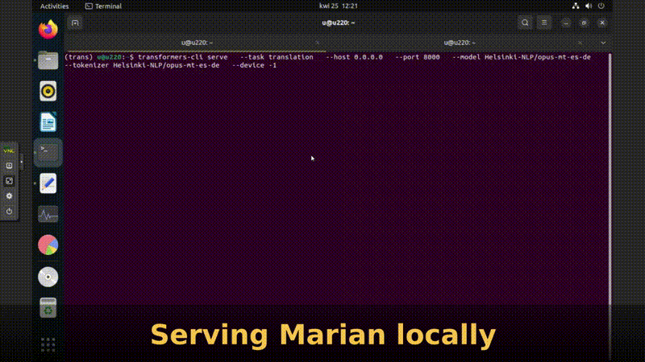

## Project Name
>English to german/spanish translator local/server using T5 model or Marian MT.


### 1. T5 
If you need to  translate  text from english  to german/french/spanish 
you could use one of many online translator services. They are convenient and quick.
If you are a company/private and don't want to share, sometimes confident information having own local translator could be better solution.
With a bit more than a 3 lines of code and even old machine all that is possible. Key word is 'transformers'.
Transformer models have taken the world of natural language processing (NLP) by storm and Hugging Face is a company
which empowered everybody with powerfull tools: open-source libraries, and pretrained models( among them [T5](https://huggingface.co/transformers/v2.7.0/model_doc/t5.html#tft5model)).
There actually more line of code taking care about cosmetic of two used widgets compared to translation. 

#### _comparing local and online translator result_ 


### 2. MarianMT 

There two extra notebooks: (Part_A_files_preprocess_NTLK_spliting_by_sentence.ipynb, Part_B_files_text_translators_eng_to_de_es_pl.ipynb ) to be used with  T5 and MarianMT models for translation of text files.

* [Part_A_files_preprocess_NTLK_spliting_by_sentence.ipynb:](Part_A_files_preprocess_NTLK_spliting_by_sentence.ipynb) is responsible for text file preprocessing.
* [Part_B_files_text_translators_eng_to_de_es_pl.ipynb:](https://github.com/len-sla/NLP_mT5_translation/blob/main/Part_B_files_text_translators_eng_to_de_es_pl.ipynb) makes text file translation.

All model names use the following format: Helsinki-NLP/opus-mt-{src}-{tgt}
Since Marian models are smaller than many other translation models available in the library, they can be useful for fine-tuning experiments and integration tests.


#### _translation to spanish_


_I was trying also some other languages like french to polish but the results were not impressive._
Trnaslation from english to french and back  are much better

---
##  How MarianMT transformer meets docker 

> <p>How quickly with the use of cli on ubuntu machine get translation.<br>
In this example I will use spanish to german MarianMTModel 'Helsinki-NLP/opus-mt-es-de'.<br>

installing libraries:

To avoid poluting ubuntu everything will be done in virtual environment (trans).<br>
ubuntu  is virtual machine on Proxmox for convenience.

 ```
python3 -m venv trans
source trans/bin/activate
 ``` 
 and required libraries:

 ```
 pip install --no-cache-dir torch && \
 pip install --no-cache-dir transformers[serving] && \
 pip install --no-cache-dir sentencepiece && \
 pip install jq && \
 pip install protobuf
 
 ```
transformers[serving] will install in package FastAPI and Uvicorn.
FastAPI is designed to work with ASGI servers like Uvicorn.<br> While FastAPI provides the framework for building APIs,<br> Uvicorn is responsible for running the FastAPI application and handling incoming HTTP requests. 
Once everything is installed lets execute translation task

 ```
transformers-cli serve   --task translation   --host 0.0.0.0   --port 8000   --model Helsinki-NLP opus-mt-es-de   --tokenizer Helsinki-NLP/opus-mt-es-de   --device -1
 
 ```
of course other port, model and task could be assigned<br> then  it will be a question how to prepare forward POST in curl<br> I've tried to use mBart model facebook/mbart-large-50-many-to-many-mmt <br>instalation and servig was ok <br>though I was not able ot create proper POST request<br> in particular giving proper format of source and target language to translate in 
 
 
 ```
curl -X POST   http://0.0.0.0:8000/forward   -H "Content-Type: application/json"   -d '{
    "inputs": "Yo no soy sorprendido  que es possible hacer una traduccion desde una idioma a otra con transformers-cli",
    "parameters": {
      "src_lang": "es",
      "tgt_lang": "de"
    }
  }' | jq
 ``` 
and the answer was


 ```
  curl -X POST   http://0.0.0.0:8000/forward   -H "Content-Type: application/json"   -d '{
    "inputs": "Yo no soy sorprendido  que es possible hacer una traduccion desde una idioma a otra con transformers-cli",
    "parameters": {
      "src_lang": "es",
      "tgt_lang": "de"
    }
  }' 
{"output":[{"translation_text":"Ich bin nicht überrascht, dass es möglich ist, eine Übersetzung von einer Sprache in eine andere mit transformers-cli zu machen."}]}root@pve:~# 


 ```



Then next step was dockerising whole process so it will be easy transferable
I did that on alpine docker LXC in proxmox 
 Dockerfile was prepared and image created

 Dockerfile content is :

```
# Use a minimal base image
FROM python:3.9-slim-buster

# Set working directory
WORKDIR /app

# Install transformers library
RUN pip install --upgrade pip && \
    pip install --no-cache-dir torch && \
    pip install --no-cache-dir transformers[serving] && \
    pip install --no-cache-dir sentencepiece && \
    pip install jq && \
    pip install protobuf


# Clean up
RUN apt-get autoremove -y && \
    apt-get clean && \
    rm -rf /var/lib/apt/lists/* /tmp/* /var/tmp/*

EXPOSE 8888
# Define entry point
ENTRYPOINT ["transformers-cli",  "serve",  "--port=8888", "--host=0.0.0.0", "--task=translation", "--model=Helsinki-NLP/opus-mt-es-de", "--tokenizer=Helsinki-NLP/opus-mt-es-de"]

 ```
As you see the same content but placed together

image could be build( here the name "mara:04") with CLI or portainer builder
and then started

```
docker run -it  --rm -P mara:04
```


### 3. Preparing input for own mT5 model

* [preparing_input_for_mT5.ipynb:](preparing_input_for_mT5.ipynb)

* [Training_eng_pol_mT5.ipynb:](Training_eng_pol_mT5.ipynb)

First part was relativelly easy though training was not succesful as resources on COLAB without paying were not enough(details inside nootbook)

---


## Status
Project is: _in progress_, 

### Inspiration

 Project inspired by
 [Hugging Face](https://huggingface.co/)
 &&
 [fast.ai ](https://www.fast.ai/)


### Info
Created by [lencz.sla@gmail.com]
