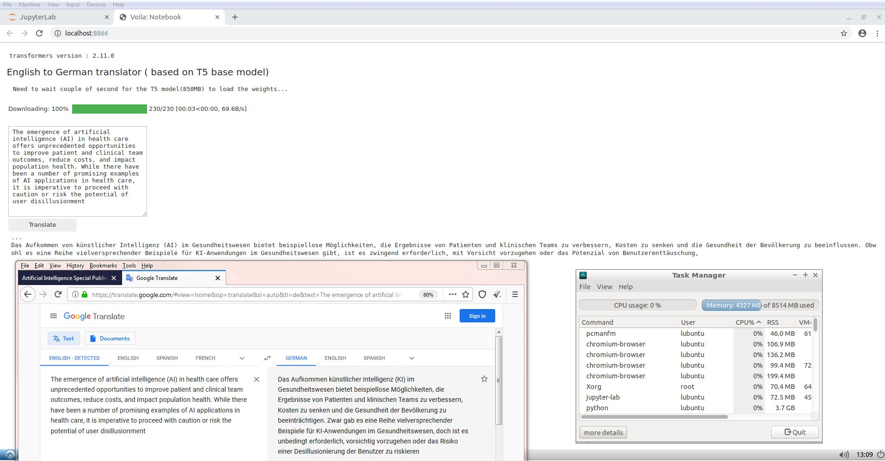
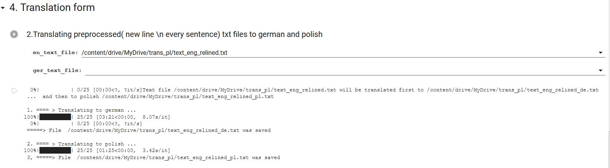
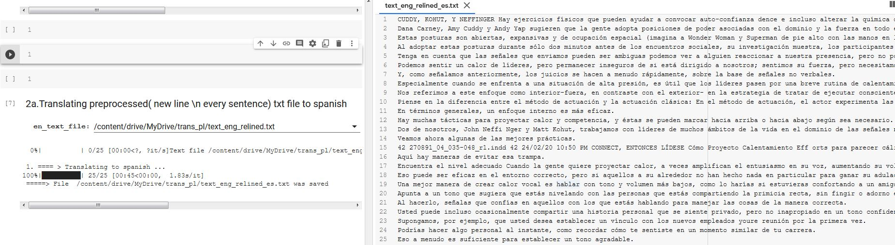

## Project Name
>English to german/spanish translator local/server using T5 model or Marian MT.

### General info
If you need to  translate  text from english  to german/french/spanish 
you could use one of many online translator services. They are convenient and quick.
If you are a company/private and don't want to share, sometimes confident information having own local translator could be better solution.
With a bit more than a 3 lines of code and even old machine all that is possible. Key word is 'transformers'.
Transformer models have taken the world of natural language processing (NLP) by storm and Hugging Face is a company
which empowered everybody with powerfull tools: open-source libraries, and pretrained models( among them [T5](https://huggingface.co/transformers/v2.7.0/model_doc/t5.html#tft5model)).
There actually more line of code taking care about cosmetic of two used widgets compared to translation. 

#### _comparing local and online translator result_ 

#### There two extra notebooks: (Part_A_files_preprocess_NTLK_spliting_by_sentence.ipynb, Part_B_files_text_translators_eng_to_de_es_pl.ipynb ) to be used with  T5 and MarianMT models for translation of text files.

* [Part_A_files_preprocess_NTLK_spliting_by_sentence.ipynb:](Part_A_files_preprocess_NTLK_spliting_by_sentence.ipynb) is responsible for text file preprocessing.
* [Part_B_files_text_translators_eng_to_de_es_pl.ipynb:](https://github.com/len-sla/NLP/blob/master/Part_B_files_text_translators_eng_to_de_es_pl.ipynb) makes text file translation.

All model names use the following format: Helsinki-NLP/opus-mt-{src}-{tgt}
Since Marian models are smaller than many other translation models available in the library, they can be useful for fine-tuning experiments and integration tests.

#### _translation to spanish_

---

## 2. Preparing input for own mT5 model

* [preparing_input_for_mT5.ipynb:](preparing_input_for_mT5.ipynb)

* [Training_eng_pol_mT5.ipynb:](Training_eng_pol_mT5.ipynb)

First part was relativelly easy though training was not succesful as resources on COLAB without paying were not enough(details inside nootbook)

---

## Status
Project is: _in progress_, 

### Inspiration

 Project inspired by
 [Hugging Face](https://huggingface.co/)
 &&
 [fast.ai ](https://www.fast.ai/)

### Info
Created by [@len-sla]
